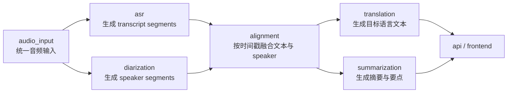

# 流水线设计

## 模块执行顺序

建议的基础执行顺序如下：

1. `audio_input`
2. `asr`
3. `diarization`
4. `alignment`
5. `translation`
6. `summarization`

其中 `audio_input` 是前置模块，负责把输入音频规范化为统一资源描述。之后 `asr` 与 `diarization` 共享同一音频来源并分别处理，`alignment` 再将两者输出融合。

## 可以并行的模块

以下模块可以并行：

1. `asr`
2. `diarization`

并行前提：

1. 二者都依赖 `audio_input` 的输出
2. 二者共享同一份音频输入描述
3. 二者互不依赖对方的中间文本结果

## 必须串行的模块

以下关系必须串行：

1. `audio_input -> asr`
2. `audio_input -> diarization`
3. `asr + diarization -> alignment`
4. `alignment -> translation`
5. `alignment -> summarization`

说明：

1. `speaker diarization` 不是从文本做，而是从音频做。
2. `ASR` 和 `diarization` 共享同一音频来源。
3. `alignment` 负责把文本和 speaker 信息按时间戳融合。
4. `translation` 和 `summarization` 依赖融合后的 transcript，而不是直接依赖原始音频。

## 中间产物列表

建议的中间产物如下：

1. `audio_asset.json`
2. `asr_segments.json`
3. `speaker_segments.json`
4. `aligned_transcript.json`

对应说明：

1. `audio_asset.json`：规范化后的音频资源描述
2. `asr_segments.json`：ASR 输出的文本片段
3. `speaker_segments.json`：说话人分离输出的说话人时间片段
4. `aligned_transcript.json`：融合后的 speaker-attributed transcript

## 最终产物列表

建议的最终产物如下：

1. `translated_transcript.json`
2. `summary.json`
3. `meeting_result.json`

对应说明：

1. `translated_transcript.json`：在融合 transcript 基础上追加翻译字段
2. `summary.json`：摘要、关键要点、行动项
3. `meeting_result.json`：供 API 聚合返回的统一结果

## Mermaid 流程图

## 关键依赖关系说明

### diarization 来源说明

说话人分离必须直接使用音频输入，不从 ASR 文本反推 speaker。文本只能作为后续融合参考，不能替代音频级说话人分析。

### ASR 与 diarization 的关系

ASR 与 diarization 读取同一份音频资源，但产物不同：

1. ASR 输出文本片段
2. diarization 输出说话人时间片段

二者属于并行分支，不应互相覆盖对方结果。

### alignment 的职责

alignment 的职责不是重新识别文本，也不是重新识别 speaker，而是按时间戳把：

1. `asr_segments`
2. `speaker_segments`

融合为可消费的 speaker-attributed transcript。

### translation 与 summarization 的输入基础

translation 与 summarization 均应基于融合后的 transcript 处理，因为此时文本已经具备：

1. 可读文本
2. 时间戳
3. speaker 归属
4. 语言信息

这样可以保证翻译和摘要结果可回溯到具体说话片段。
